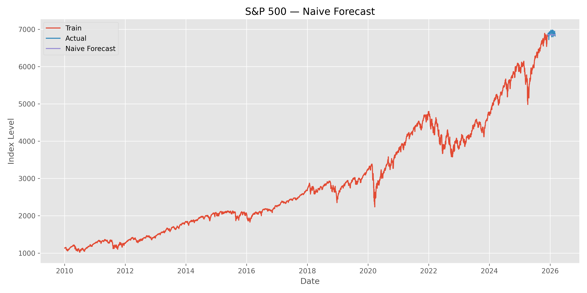
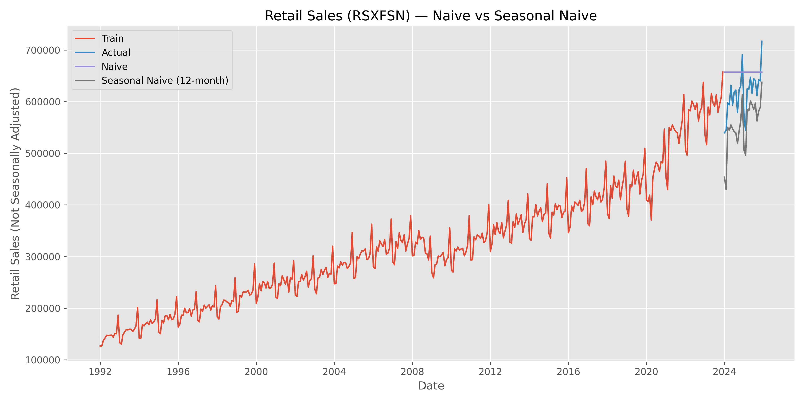
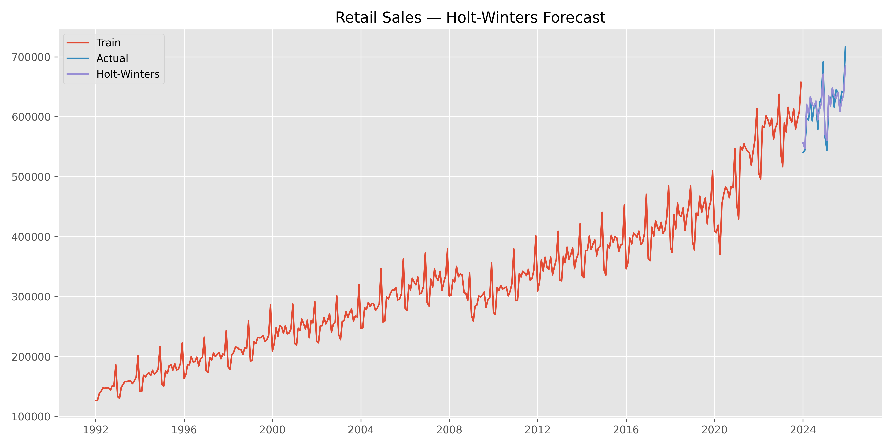

# Time Series Forecasting: Model Suitability by Data Structure

This project explores how different time series models perform depending on the structural characteristics of the data.

Rather than applying models blindly, each model is evaluated on data that aligns with its assumptions.

---

## Case Study 1: When the Naive Model Is Optimal  
### Dataset: S&P 500 Daily Closing Prices

### Objective
Demonstrate a scenario where a naive forecast is theoretically justified and empirically strong.

### Model
Naive forecast:

\[
\hat{y}_{t+1} = y_t
\]

Tomorrow’s value equals today’s value.

Equivalent to:
- ARIMA(0,1,0)
- Random walk model

### Evaluation Setup
- Last 90 days held out as test set
- Chronological train/test split
- Metrics: MAPE, MAE, RMSE

### Results

| Metric | Value |
|--------|-------|
| MAPE | 0.83% |
| MAE | 57.57 |
| RMSE | 68.67 |

### Interpretation

The naive forecast achieved extremely low percentage error.

This suggests:
- The S&P 500 behaves close to a random walk.
- Short-term forecasting is extremely difficult.
- Additional model complexity may not yield meaningful gains.

---

# Case Study 2: Trend + Seasonality
## Dataset: U.S. Retail Sales (Not Seasonally Adjusted)

### Objective
Evaluate naive vs seasonal naive on a modern series with strong seasonal effects *and* strong trend, and use the outcome to motivate a better-suited model.

### Dataset Details
- Source: FRED `RSXFSN` (Not Seasonally Adjusted)
- Frequency: Monthly
- Time range: 1992–Present
- Target: Retail sales level
- Note: We intentionally use **not seasonally adjusted** data so the seasonal pattern remains in the series.

### Models Compared
**Naive**
\\[
\\hat{y}_{t+1} = y_t
\\]

**Seasonal Naive (12-month)**
\\[
\\hat{y}_{t+12} = y_t
\\]
Forecast for a given month equals the same month from the previous year.

### Evaluation Setup
- Holdout: last 24 months (**2024-01** to **2025-12**)
- Chronological train/test split
- Metrics: MAPE, MAE, RMSE

### Results
| Model | MAPE | MAE | RMSE |
|---|---:|---:|---:|
| Naive | **8.30%** | 49,084.38 | 58,606.81 |
| Seasonal Naive (12) | 10.00% | 61,143.33 | 64,245.21 |

### Interpretation
Contrary to the “seasonal naive should win” intuition, **naive outperformed seasonal naive** in this modern retail dataset.

This suggests:
- Retail sales have strong yearly seasonality **and** strong upward trend.
- Seasonal naive captures the repeating seasonal pattern, but **does not account for growth**.
- Using last year’s value can systematically underpredict the current level when trend dominates seasonal amplitude.

In this holdout period, the series behaved more like “level persistence with trend” than “stable year-over-year repetition.”

### Visual

### Key Insight
**Seasonal naive handles repeating patterns, but fails when trend is strong.**

This motivates a model family that estimates:
- Level
- Trend
- Seasonality

## Holt-Winters (Triple Exponential Smoothing)

### Why Holt-Winters?
The retail sales series exhibits **both**:

- **Trend** (the overall level rises over time)
- **Yearly seasonality** (recurring holiday-driven peaks and troughs)

Naive forecasting captures short-term persistence, and seasonal naive captures repeating patterns, but neither can represent **trend + seasonality simultaneously**. Holt-Winters explicitly models:

- **Level** (baseline value)
- **Trend** (direction and rate of change)
- **Seasonality** (recurring annual pattern)

### Model specification
We fit Holt-Winters exponential smoothing with:

- **Additive trend**
- **Additive seasonality** (period = 12 months)

This configuration is appropriate when seasonal swings are relatively constant in magnitude over time.

### Evaluation setup
- Holdout window: **2024-01** to **2025-12** (last 24 months)
- Metrics: MAPE, MAE, RMSE
- Chronological train/test split (no shuffling)

### Results

| Model | MAPE |
|---|---:|
| Naive | 8.30% |
| Seasonal Naive (12) | 10.00% |
| **Holt-Winters** | **1.80%** |

### Interpretation
Holt-Winters dramatically outperformed both baselines, indicating that retail sales are highly predictable once **trend and seasonality** are modeled jointly.

- Seasonal naive underperformed because it uses last year’s value and does not adjust for **year-over-year growth**.
- Naive underperformed because it ignores the **annual seasonal pattern**.
- Holt-Winters succeeded because it estimates level, trend, and seasonality together.

### Key insight
**When a time series contains both trend and stable seasonality, Holt-Winters can deliver large forecast accuracy gains over naive baselines.**

### Visual

"""
---
